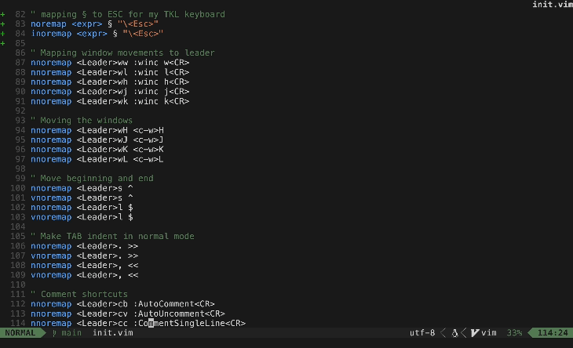

## What is Pop! terminal?

*Pop! terminal* is a small Neovim plugin that allows you to open a terminal window inside your working buffer.

Its for running terminal tasks without leaving your code.



## Installation

This plugin uses [nui](https://github.com/MunifTanjim/nui.nvim)

Use your preferred package manager to download the plugin e.g. `vim-plug` 

```
Plug 'https://github.com/MunifTanjim/nui.nvim'
Plug 'https://github.com/Coockson/popterminal.nvim'
```

In your init file add the following

```
require('popterminal')
```

## How to use

`:PopTerminal`

Opens the terminal in a window inside the current buffer. Press `Esc` to exit from the terminal.

It us suggested that you bind the command to a shotcut to access *Pop! terminal* quickly.

`nnoremap <Leader>t :PopTerminal<CR>`
